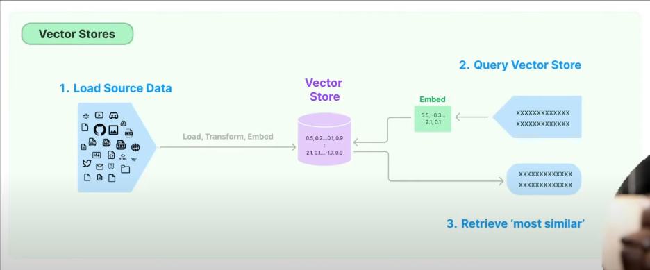

# Chatbot with Llama2

## My Learnings:
1. ```from langchain_core.output_parsers import StrOutputParser```

* ```parser = StrOutputParser()``` : Used to extract the relevant information from the raw output of the foundational model to human readable format and provides plain text (string)
***

2. **Envinormental Varibles**:
* In essence, the environment variable provides the API key value, but the code actively checks for its existence and uses it if available.
***
3. ```python-dotenv()```: Used to load the sensitive information present in ```.env()``` file to the current file.
* In summary, **python-dotenv** is a valuable tool for managing environment variables in Python projects, providing a secure and convenient way to store and access sensitive configuration details from a .env file.
***
4.  ```pypdf``` vs ```PyPDFLoader```:
* **pypdf** extracts text, manipulates PDF pages.
* **PyPDFLoader** (built on pypdf) tailors text for Langchain's RAG tasks.
* **PyPDFLoader** might segment text, handle formatting for RAG compatibility.
* Use **pypdf** for basic needs and manual processing.
* Choose **PyPDFLoader** for simplified **RAG** workflow with Langchain.
***
5. ```RecursiveCharacterTextSplitter()```: 
* **Recursion** is a concept where a function or process calls itself within its own definition. 
*  If the text after splitting with delimiters(**order**: Newline characters (\n), Paragraph breaks (\n\n), white space, and so on ) is still larger than the specified chunk_size, the function recursively calls itself on each resulting segment. This process continues until all segments are either smaller than or equal to the chunk_size.
***

# RAG Pipeline:

### Step 1: Load the Source Data
1. **Data ingestion:** We import data from different ways like from pdfs,text files, Excel files, Readme file, directories and web. I used the following classes from langchain in this project: ```PyPDFLoader```, ```WebBaseLoader```, ```TextLoader```.
2. **Transform:** The document will be divided into chunks of specified length using ```RecursiveCharacterTextSplitter```
3. **Embed:**
### Step 2: Query Vector Store
* We store the embeded data into vector data bases (Chroma,faiss,lance) so that we can query(prompt) what we want!
* Instead of giving manual prompt, we combine the this prompt with CHAINS and RETRIVER. so that we get better results.
* **Retrivers:** A retriever is an interface that returns or retrieve documents from the vector store. It doesn't store any documents. Vector stores can be used as the backbone of a retriever. 
* https://python.langchain.com/docs/modules/data_connection/retrievers/
* **Retrieval Chain:** This Chain takes in a user inquiry, which is then passed to the retriever to fetch relevant documents. Those documents(and original inputs) are then passed to an LLM to generate a response
* Chains: https://python.langchain.com/docs/modules/chains/
### Step 3: Retrive Most Similar
* Using similarity_search we can retrive Most similar vector.

## Advanced Retrieval-Augmented Generation (RAG) Pipeline

This document describes an advanced Retrieval-Augmented Generation (RAG) pipeline that leverages retrieved documents to enhance the context for a large language model (LLM), resulting in more informative and relevant responses.

### Pipeline Stages

The pipeline consists of the following stages:

1. **User Prompt or Query:** The user initiates the interaction by providing a question or request.

2. **ChatPromptTemplate (Optional):** (**Conditional Step**)
   - In some implementations, a pre-defined template (`ChatPromptTemplate`) might be used to augment the user input.
   - This template offers additional context or information to guide the retrieval process, potentially leading to more targeted document selection.

3. **Retriever:**
   - The combined input (user prompt potentially with the template) is sent to the retriever.
   - The retriever acts as an interface, searching the vector database for documents that are semantically similar to the user's input.
   - It leverages techniques like FAISS (Facebook AI Similarity Search) to efficiently find documents based on their pre-computed embedding vectors, which capture their semantic meaning.

4. **Vector Database:**
   - This database stores pre-processed documents in a way that facilitates fast retrieval using their embedding vectors.
   - These embeddings represent the documents' semantic content in a high-dimensional numerical space.

5. **List of Documents:**
   - The retriever returns a list of the most relevant documents from the vector database based on the user's input.

6. **Create_stuff_documents_chain:** (**Custom Function**)
   - This custom function takes the user input and the retrieved documents as input.
   - Its role is to create a new prompt for the LLM by combining these elements.
   - The specific implementation details might vary, but it typically involves:
     - Summarizing the retrieved documents to extract their key points.
     - Combining the user input, document summaries, and any additional context into a cohesive prompt that effectively guides the LLM.

7. **LLM (Large Language Model):**
   - The generated prompt, enriched with information from the retrieved documents, is fed to the LLM.
   - The LLM utilizes its knowledge and the context provided in the prompt to generate a response that is directly relevant to the user's original input.

### Benefits of This Approach

- **Enhanced Context:** By incorporating retrieved documents, the LLM has a richer understanding of the user's intent and can generate more informative and on-point responses.
- **Improved Relevance:** The retrieval process helps ensure that the LLM focuses on documents that are semantically relevant to the user's query, leading to more accurate and pertinent responses.

This advanced RAG pipeline offers a powerful way to leverage the capabilities of LLMs by providing them with additional context through retrieved documents. This can significantly improve the quality and relevance of the generated responses in various conversational AI applications.
***
# Multiple Data Sources With Langchain

1. **Tools:** Tools in langchain help us to fetch data from different sources like wikipedia, google scholar, arxiv, pdfs and so on.
2. **Agents:** The core idea of agents is to use a language model to choose a sequence of actions to take. In chains, a sequence of actions is hardcoded (in code). In agents, a language model is used as a reasoning engine to determine which actions to take and in which order.


